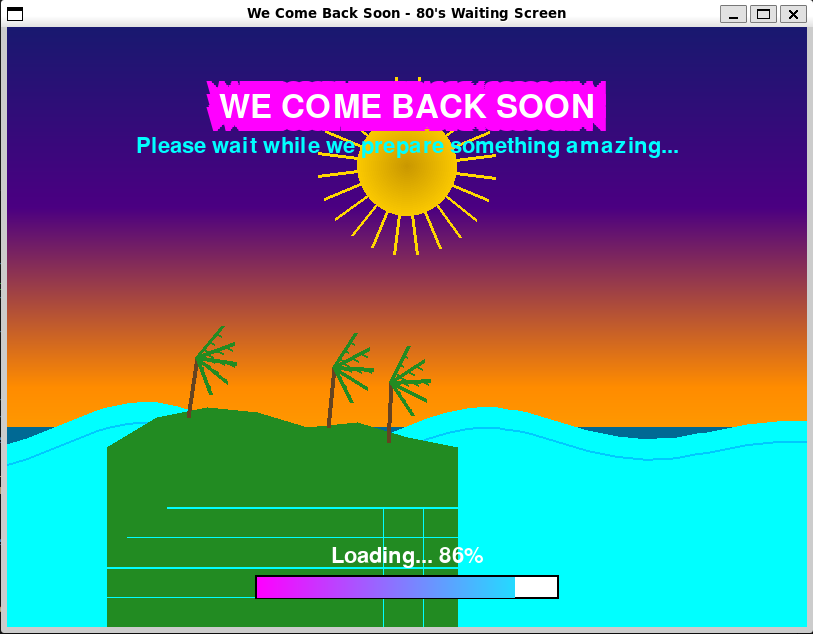

# 80's Style Waiting Screen

A beautiful retro-styled waiting screen featuring an animated 8-bit island sunset scene with the message "WE COME BACK SOON".



## Two Versions Available

### 🎮 Full Graphics Version (`main.py`)
- **Requires**: pygame library
- **Features**: Full graphics with smooth animations, colors, and effects
- **Best for**: Systems with pygame support

### 📺 ASCII Terminal Version (`ascii_main.py`)  
- **Requires**: Only Python standard library
- **Features**: Retro ASCII art animation in terminal
- **Best for**: Any system, fallback option

## Features

- **Retro 80's Aesthetic**: Classic neon colors and retro styling
- **Animated Island Scene**: Beautiful sunset with palm trees swaying in the breeze
- **Dynamic Elements**:
  - Pulsing sun with animated rays
  - Animated ocean waves with reflections
  - Swaying palm trees
  - Retro grid effect at the bottom
  - Glowing text effects
  - Animated loading bar

## Quick Start

### Easy Launcher (Recommended)
```bash
python3 run.py
```
The launcher will automatically:
- Check for pygame availability
- Offer to install pygame if missing
- Let you choose between versions
- Fall back to ASCII if needed

### Manual Usage

**Graphics version:**
```bash
pip3 install pygame
python3 main.py
```

**ASCII version (no dependencies):**
```bash
python3 ascii_main.py
```

## Controls

- **ESC**: Exit the waiting screen
- **Close Window**: Exit the application

## Technical Details

- Built with Python and Pygame
- 60 FPS smooth animations
- 800x600 resolution
- Optimized for performance
- Cross-platform compatibility

The waiting screen creates a nostalgic 80's atmosphere perfect for loading screens, intermissions, or any situation where you need to keep users entertained while they wait.

Enjoy the retro vibes! 🌴🌅✨
